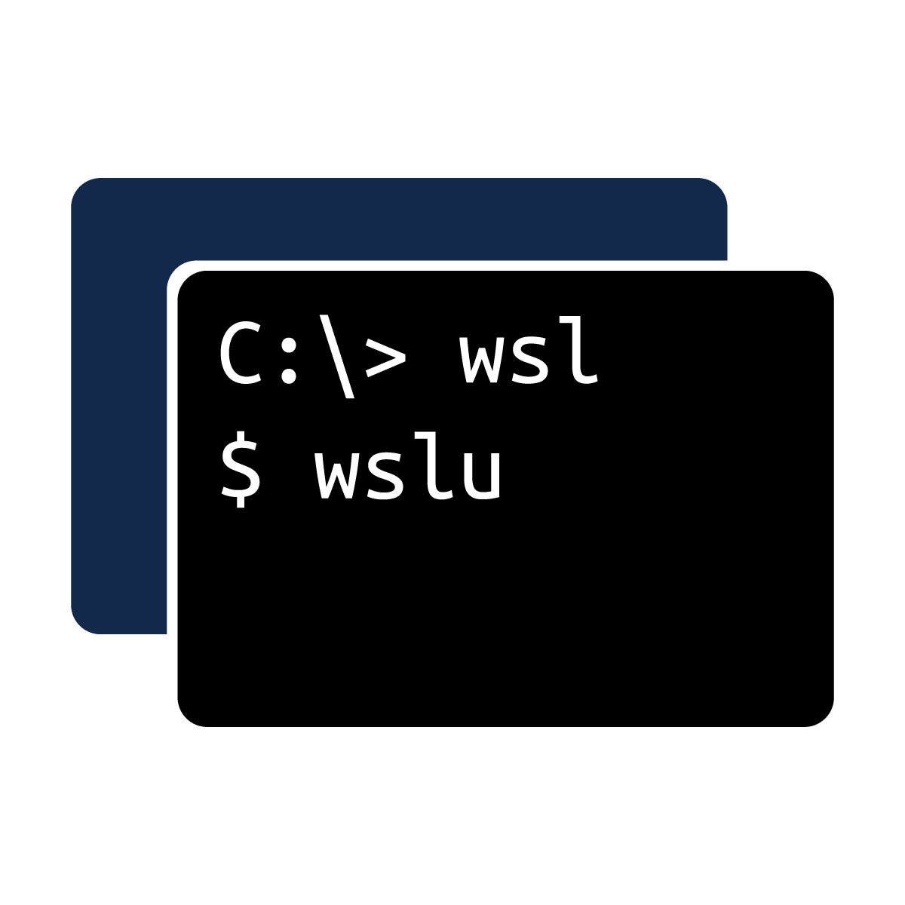

# wslu - A collection of utilities for WSL

> **ATTENTION!**
> 
> Built-in versions of wslu in Ubuntu are no longer supported by me.
>
> If you have problems, please check whther you are using the [PPA version of wslu](https://launchpad.net/~wslutilities/+archive/ubuntu/wslu). If not, please report to the Ubuntu WSL team; However, the PPA version of wslu will address most issue that come from the built-in version.

This is a collection of utilities for the Windows Subsystem for Linux (WSL), such as converting Linux paths to Windows paths or creating  Linux application shortcuts on the Windows Desktop.

 - Requires at least Windows 10 Creators Update;
 - Some of the features require a higher version of Windows;
 - Supports WSL2;
 - Supports Windows 11.

|  | English | 简体中文 | 正體中文 | Esperanto |
| - | - | - | - | - |
| General | [Visit](https://wslutiliti.es/wslu/) | [Visit](https://wslutiliti.es/wslu/zh-CN/) | [Visit](https://wslutiliti.es/wslu/zh-TW/) | [Visit](https://wslutiliti.es/wslu/eo/) |
| Installation | [Visit](https://wslutiliti.es/wslu/install.html) | [Visit](https://wslutiliti.es/wslu/zh-CN/install.html) | [Visit](https://wslutiliti.es/wslu/zh-TW/install.html) | [Visit](https://wslutiliti.es/wslu/eo/install.html) |

## Contributors

This project exists thanks to all the people who contribute. [ [Contribute](CONTRIBUTING.md) ].

## License & Credits

This project uses [GPLv3](LICENSE) License.

Logo of WSL Utilities and icons for `wslusc` desktop shortcuts are licensed under [CC BY 4.0 International License](http://creativecommons.org/licenses/by/4.0/).

For other third-party files and assets used, please refer to [THIRD_PARTY_LICENSE](THIRD_PARTY_LICENSE).
